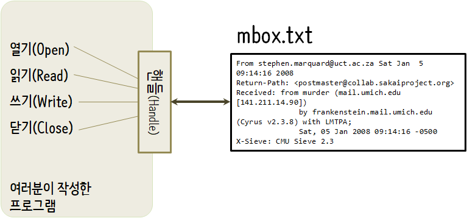

# 파일 {#r-file}

## 영속성(Persistence) {#r-file-persistence}

지금까지, 프로그램을 어떻게 작성하고 조건문, 함수, 반복을 사용하여 
중앙처리장치(CPU, Central Processing Unit)에 프로그래머의 의도를 커뮤니케이션하는지 학습했다.
주기억장치(Main Memory)에 어떻게 자료구조를 생성하고 사용하는지도 배웠다.
CPU와 주기억장치는 소프트웨어가 동작하고 실행되는 곳이고, 모든 "생각(thinking)"이 발생하는 장소다.

하지만, 앞서 하드웨어 아키텍처를 논의했던 기억을 되살린다면,
전원이 꺼지게 되면, CPU와 주기억장치에 저장된 모든 것이 지워진다.
지금까지 작성한 프로그램은 R을 배우기 위한 일시적으로 재미로 연습한 것에 불과하다.


이번 장에서 보조 기억장치(Secondary Memory) 혹은 파일을 가지고 작업을 시작한다.
보조 기억장치는 전원이 꺼져도 지워지지 않는다.
혹은, USB 플래쉬 드라이브를 사용한 경우에는 프로그램으로부터 작성한 데이터는 시스템에서 제거되어 다른 시스템으로 전송될 수 있다.

우선 텍스트 편집기로 작성한 텍스트 파일을 읽고 쓰는 것에 초점을 맞출 것이다.
나중에 데이터베이스 소프트웨어를 통해서 읽고 쓰도록 설계된 바이너리 파일 데이터베이스를 가지고 어떻게 작업하는지를 살펴볼 것이다.

## 파일 열기 {#r-file-open}

하드 디스크 파일을 읽거나 쓸려고 할 때, 파일을 열어야(open) 한다.
파일을 열 때 각 파일 데이터가 어디에 저장되었는지를 알고 있는 운영체제와 커뮤니케이션 한다.
파일을 열 때, 운영체제에 파일이 존재하는지 확인하고 이름으로 파일을 찾도록 요청한다.     
이번 예제에서, <www.py4inf.com/code/mbox.txt> 에서 파일을 다운로드한 후 
R을 시작한 동일한 폴더에 저장된 `mbox.txt` 파일을 연다.

`download.file("http://www.py4inf.com/code/mbox.txt", destfile = "data/mbox.txt")` 명령어를 사용하여 
코딩을 시작하는 디렉토리 아래 `data` 디렉토리를 만들고 동일한 `mbox.txt` 이름으로 저장한다.

``` {r r-file-open}
# download.file("http://www.py4inf.com/code/mbox.txt", destfile = "data/mbox.txt")

fhand <- file("data/mbox.txt", open = "r")
fhand
```

`open`이 성공하면, 운영체제는 **파일 핸들(file handle)**을 반환한다.
파일 핸들(file handle)은 파일에 담겨진 실제 데이터는 아니고, 
대신에 데이터를 읽을 수 있도록 사용할 수 있는 "핸들(handle)"이다.
요청한 파일이 존재하고, 파일을 읽을 수 있는 적절한 권한이 있다면 이제 핸들이 여러분에게 주어졌다.



파일이 존재하지 않는다면, open은 역추적(traceback) 파일 열기 오류로 실패하고, 파일 콘텐츠에 접근할 핸들도 얻지 못한다.

``` {r r-file-open-error, eval=FALSE}
> fhand <- file("data/stuff.txt", "r")
Error in file("data/stuff.txt", "r") : cannot open the connection
In addition: Warning message:
In file("data/stuff.txt", "r") :
  cannot open file 'data/stuff.txt': No such file or directory
```

나중에 `tryCatch()`를 가지고, 존재하지 않는 파일을 열려고 하는 상황을 좀더 우아하게 처리할 것이다.

최근에 사용자 중심으로 R에 다양한 기능이 추가되어 `tidyverse` 팩키지 일부를 구성하는 
`readr` 팩키지의 `read_lines()` 함수를 통해 인터넷 웹사이트에서 바로 불러오는 것도 가능하다.

``` {r r-file-open-tidyverse}
# library(tidyverse)

txt_file <- readr::read_lines("http://www.py4inf.com/code/mbox.txt")

head(txt_file)
```


## 텍스트 파일과 라인 {#r-file-txt}

R 문자열이 문자 순서(sequence)로 간주 되듯이 마찬가지로 텍스트 파일은 줄(라인, line) 순서(sequence)로 생각될 수 있다.
예를 들어, 다음은 오픈 소스 프로젝트 개발 팀에서 다양한 참여자들의 전자우편 활동을 기록한 텍스트 파일 샘플이다.

``` {r r-file-mbox-sample, eval=FALSE}
From stephen.marquard@uct.ac.za Sat Jan  5 09:14:16 2008
Return-Path: <postmaster@collab.sakaiproject.org>
Date: Sat, 5 Jan 2008 09:12:18 -0500
To: source@collab.sakaiproject.org
From: stephen.marquard@uct.ac.za
Subject: [sakai] svn commit: r39772 - content/branches/
Details: http://source.sakaiproject.org/viewsvn/?view=revrev=39772
...
```


상호 의사소통한 전자우편 전체 파일은 <www.py4inf.com/code/mbox.txt> 에서 접근 가능하고, 
간략한 버젼 파일은 <www.py4inf.com/code/mbox-short.txt> 에서 얻을 수 있다.
이들 파일은 다수 전자우편 메시지를 담고 있는 파일로 표준 포맷으로 되어 있다.
"From "으로 시작하는 라인은 메시지 본문과 구별되고, "From: "으로 시작하는 라인은 본문 메시지의 일부다.
더 자세한 정보는 <http://en.wikipedia.org/wiki/Mbox>에서 찾을 수 있다.

파일을 라인으로 쪼개기 위해서, 새줄(newline) 문자로 불리는 "줄의 끝(end of the line)"을 표시하는 특수 문자가 있다.

R에서, 문자열 상수 역슬래쉬-n(\n)으로 새줄(newline) 문자를 표현한다.
두 문자처럼 보이지만, 사실은 단일 문자다. 인터프리터에 "stuff"에 입력한 후 변수를 살펴보면, 문자열에 \n가 있다.
하지만, `cat`문을 사용하여 문자열을 출력하면, 문자열이 새줄 문자에 의해서 두 줄로 쪼개지는 것을 볼 수 있다.

``` {r r-file-newline}
stuff <- 'Hello\nWorld!'
stuff
cat(stuff)

stuff <- 'X\nY'
cat(stuff)

str_length(stuff)
```

문자열 'X\nY'의 길이는 `stringr::str_length("X\nY")` 명령어를 통해 확인이 가능한데 `r stringr::str_length("X\nY")` 이다. 왜냐하면 새줄(newline) 문자도 한 문자이기 때문이다.

그래서, 파일 라인을 볼 때, 라인 끝을 표시하는 새줄(newline)로 불리는 눈에 보이지 않는 특수 문자가 각 줄의 끝에 있다고 상상할 필요가 있다.

그래서, 새줄(newline) 문자는 파일에 있는 문자를 라인으로 분리한다.


## 파일 읽어오기 {#r-file-open-handler}

파일 핸들(file handle)이 파일 자료를 담고 있지 않지만, 
for 루프를 사용하여 파일 각 라인을 읽고 라인수를 세는 것을 쉽게 구축할 수 있다.

``` {r r-file-open-count}
fhand <- file('data/mbox.txt', open = "r")
count <- 0
for(line in readLines(fhand)) {
  count <- count + 1
}

cat('Line Count:', count, "\n")
close(fhand)
```


파일 핸들을 `for` 루프 순서(sequence)로 사용할 수 있다. 
`for` 루프는 단순히 파일 라인 수를 세고 전체 라인수를 출력한다.
`for` 루프를 대략 일반어로 풀어 말하면, 
"파일 핸들로 표현되는 파일 각 라인마다, `count` 변수에 1 씩 더한다"

`file` 함수가 전체 파일을 바로 읽지 못하는 이유는 파일이 수 기가 바이트 파일 크기를 가질 수도 있기 때문이다.
`file` 문장은 파일 크기에 관계없이 파일을 여는데 시간이 동일하게 걸린다. 
실질적으로 `for` 루프가 파일로부터 자료를 읽어오는 역할을 한다.

`for` 루프를 사용해서 이 같은 방식으로 파일을 읽어올 때, 새줄(newline) 문자를 사용해서 파일 자료를 라인 단위로 쪼갠다.
파이썬에서 새줄(newline) 문자까지 각 라인 단위로 읽고, 
`for` 루프가 매번 반복할 때마다 line 변수에 새줄(newline)을 마지막 문자로 포함한다.

`for` 루프가 데이터를 한번에 한줄씩 읽어오기 때문에, 데이터를 저장할 주기억장치 저장공간을 소진하지 않고, 매우 큰 파일을 효과적으로 읽어서 라인을 셀 수 있다.
각 라인별로 읽고, 세고, 그리고 나서 폐기되기 때문에, 매우 적은 저장공간을 사용해서 어떤 크기의 파일도 상기 프로그램을 사용하여 라인을 셀 수 있다.

만약 주기억장치 크기에 비해서 상대적으로 작은 크기의 파일이라는 것을 안다면, 
전체 파일을 파일 핸들로 `readLines()` 함수를 사용해서 문자열로 읽어올 수 있다.

``` {r r-file-input}
fhand <- file("data/mbox-short.txt", open = "r")
inp <- readChar(fhand, nchars=1e6)
str_length(inp)

close(fhand)

str_sub(inp, 1, 20)
```


상기 예제에서, `mbox-short.txt` 전체 파일 콘텐츠(96,536 문자)를 변수 `inp`로 바로 읽었다.
문자열 슬라이싱을 사용해서 `inp`에 저장된 문자열 자료 첫 20 문자를 출력한다.

파일이 이런 방식으로 읽혀질 때, 모든 라인과 새줄(newline)문자를 포함한 모든 문자는 변수 `inp`에 대입된 매우 큰 문자열이다.
파일 데이터가 컴퓨터 주기억장치가 안정적으로 감당해 낼 수 있을때만, 
이런 형식의 `readChar()` 함수가 사용될 수 있다는 것을 기억하라.

만약 주기억장치가 감당해 낼 수 없는 매우 파일 크기가 크다면, `for`나 `while` 루프를 사용해서 파일을 쪼개서 읽는 프로그램을 작성해야 한다.


## 파일 검색 {#r-file-search}

파일 데이터를 검색할 때, 흔한 패턴은 파일을 읽고, 대부분 라인은 건너뛰고, 특정 기준을 만족하는 라인만 처리하는 것이다.
간단한 검색 메카니즘을 구현하기 위해서 파일을 읽는 패턴과 문자열 메쏘드를 조합한다.

예를 들어, 파일을 읽고, "From:"으로 시작하는 라인만 출력하고자 한다면, 
`stringr` 팩키지에 포함된 `str_detect()` 문자열 탐지 함수를 사용해서 원하는 접두사(From:)로 시작하는 라인만을 선택한다.

``` {r r-file-print-from, eval = FALSE}
fhand <- file('data/mbox-short.txt', open = "r")

for(line in readLines(fhand)) {
  if(str_detect(line, "^From:")) {
    print(line)
  }
}
```

이 프로그램이 실행하면 다음 출력값을 얻는다.

``` {r r-file-print-from-output, eval = FALSE}
[1] "From stephen.marquard@uct.ac.za Sat Jan  5 09:14:16 2008"
[1] "From: stephen.marquard@uct.ac.za"
[1] "From louis@media.berkeley.edu Fri Jan  4 18:10:48 2008"
[1] "From: louis@media.berkeley.edu"
[1] "From zqian@umich.edu Fri Jan  4 16:10:39 2008"
[1] "From: zqian@umich.edu"
[1] "From rjlowe@iupui.edu Fri Jan  4 15:46:24 2008"
```

"From:"으로만 시작하는 라인만 출력하기 때문에 출력값은 훌륭해 보인다.

파일 처리 프로그램이 점점 더 복잡해짐에 따라 `next`를 사용해서 검색 루프(search loop)를 구조화할 필요가 있다.
검색 루프의 기본 아이디어는 "흥미로운" 라인을 집중적으로 찾고, "흥미롭지 않은" 라인은 효과적으로 건너뛰는 것이다.
그리고 나서 흥미로운 라인을 찾게되면, 그 라인에서 특정 연산을 수행하는 것이다.

다음과 같이 루프를 구성해서 흥미롭지 않은 라인은 건떠뛰는 패턴을 따르게 한다.

``` {r r-file-print-from-skip, eval = FALSE}
fhand <- file('data/mbox-short.txt', open = "r")

for(line in readLines(fhand)) {
  if(!str_detect(line, "^From:")) {
    next
  }
  print(line)
}
```

프로그램의 출력값은 동일하다. 
흥미롭지 않는 라인은 "From:"으로 시작하지 않는 라인이라 `next`문을 사용해서 건너뛴다.
"흥미로운" 라인 (즉, "From:"으로 시작하는 라인)에 대해서는 연산처리를 수행한다. 

`str_detect()` 문자열 함수를 사용해서 검색 문자열이 라인 어디에 있는지를 찾아주는 텍스트 편집기 검색기능을 모사(simulation)할 수 있다.
`str_detect()` 문자열 함수는 다른 문자열 내부에 검색하는 문자열이 있는지 찾고, 존재하는 경우 참(TRUE) 만약 문자열이 없다면 거짓(FALSE)을 반환하기 때문에,
"@uct.ac.za"(남아프리카 케이프 타운 대학으로부터 왔다) 문자열을 포함하는 라인을 검색하기 위해 다음과 같이 루프를 작성한다.

``` {r r-file-find-email, eval = FALSE}
fhand <- file('data/mbox-short.txt', open = "r")

for(line in readLines(fhand)) {
  if(!str_detect(line, "@uct.ac.za")) {
    next
  }
  print(line)
}
```

출력결과는 다음과 같다.

``` {r r-file-find-email-output, eval = FALSE}
[1] "From stephen.marquard@uct.ac.za Sat Jan  5 09:14:16 2008"
[1] "X-Authentication-Warning: nakamura.uits.iupui.edu: apache set sender to stephen.marquard@uct.ac.za using -f"
[1] "From: stephen.marquard@uct.ac.za"
[1] "Author: stephen.marquard@uct.ac.za"
[1] "From david.horwitz@uct.ac.za Fri Jan  4 07:02:32 2008"
[1] "X-Authentication-Warning: nakamura.uits.iupui.edu: apache set sender to david.horwitz@uct.ac.za using -f"
[1] "From: david.horwitz@uct.ac.za"
[1] "Author: david.horwitz@uct.ac.za"
[1] "r39753 | david.horwitz@uct.ac.za | 2008-01-04 13:05:51 +0200 (Fri, 04 Jan 2008) | 1 line"
[1] "From david.horwitz@uct.ac.za Fri Jan  4 06:08:27 2008"
[1] "X-Authentication-Warning: nakamura.uits.iupui.edu: apache set sender to david.horwitz@uct.ac.za using -f"
```

## 사용자가 파일명을 선택하게 만들기 {#r-file-user-input}

매번 다른 파일을 처리할 때마다 R 코드를 편집하고 싶지는 않다. 
매번 프로그램이 실행될 때마다, 파일명을 사용자가 입력하도록 만드는 것이 좀더 유용할 것이다. 
그래서 R 코드를 바꾸지 않고, 다른 파일에 대해서도 동일한 프로그램을 사용하도록 만들자.

다음과 같이 `commandArgs`을 사용해서 사용자로부터 파일명을 읽어 프로그램을 실행하는 것이 단순하다.
`file-user-input.R` 파일에 다음과 같이 R 스크립트를 작성한다. 
자세한 사항은 [R 병렬 프로그래밍](http://statkclee.github.io/parallel-r/)을 참조한다. [^xwMOOC-rscript]
그리고, 사용자의 입력을 받도록 하는 프롬프트를 생략하고 바로 쉘에서 인자를 넘기는 것으로 프로그램을 작성했다.

[^xwMOOC-rscript]: [.R 스크립트를 인자와 함께 실행](http://statkclee.github.io/parallel-r/r-parallel-rscript-args.html)

``` {r r-file-user-input, eval = FALSE}
#!/usr/bin/env Rscript
library(stringr)

args <- commandArgs(trailingOnly=TRUE)
fname <- args[1]

fhand <- file(fname, open = "r")

count <- 0
for(line in readLines(fhand)) {
  if(str_detect(line, "Subject:")) {
    count <- count + 1
  }
}

cat('There were', count, 'subject lines in', fname)
```

사용자로부터 파일명을 읽고 변수 `fname`에 저장하고, 그 파일을 연다. 
이제 다른 파일에 대해서도 반복적으로 프로그램을 실행할 수 있다.
RStudio `Terminal` (`Console` 패널 아님)을 열고 다음과 같이 인자를 넘겨 실행하면 된다.

``` {r r-file-user-input-res, eval = FALSE}
D:\docs\r4inf\code>Rscript file-user-input.R "../data/mbox-short.txt"
There were 27 subject lines in ../data/mbox-short.txt
```

다음 절을 엿보기 전에, 상기 프로그램을 살펴보고 자신에게 다음을 질문해 보자.
"여기서 어디가 잘못될 수 있는가?" 혹은 
"이 작고 멋진 프로그램에 트레이스백(traceback)을 남기고 바로 끝나게 하여,
결국 사용자 눈에는 좋지 않은 프로그램이라는 인상을 남길 수 있도록 우리의 친절한 사용자는 무엇을 할 수 있을까?"


## tryCatch 사용하기 {#r-file-trycatch}

제가 여러분에게 엿보지 말라고 말씀드렸습니다. 이번이 마지막 기회입니다.
사용자가 파일명이 아닌 뭔가 다른 것을 입력하면 어떻게 될까요?

``` {r r-file-user-wrong-input, eval = FALSE}
D:\docs\r4inf\code>Rscript file-user-input.R "../data/missing.txt"
Error in file(fname, open = "r") :
: ():
In file(fname, open = "r") :
   '../data/missing.txt'  : No such file or directory

D:\docs\r4inf\code>Rscript file-user-input.R "na na boo boo"
Error in file(fname, open = "r") :
: ():
In file(fname, open = "r") :
   'na na boo boo'  : No such file or directory

```

웃지마시구요, 사용자는 결국 여러분이 작성한 프로그램을 망가뜨리기 위해 고의든 악의를 가지든 가능한 모든 수단을 강구할 것입니다.
사실, 소프트웨어 개발팀의 중요한 부분은 **품질 보증(Quality Assurance, QA)**이라는 조직이다. 
품질보증 조직은 프로그래머가 만든 소프트웨어를 망가뜨리기 위해 가능한 말도 안 되는 것을 합니다.

사용자가 소프트웨어를 제품으로 구매하거나, 주문형으로 개발하는 프로그램에 대해 월급을 지급하던지 관계없이 
품질보증 조직은 프로그램이 사용자에게 전달되기 전까지 프로그램 오류를 발견할 책임이 있다.
그래서 품질보증 조직은 프로그래머의 최고의 친구다.

프로그램 오류를 찾았기 때문에, `tryCatch` 구조를 사용해서 오류를 우아하게 고쳐봅시다.
파일 열기 `file()` 호출이 잘못될 수 있다고 가정하고, `file()` 호출이 실패할 때를 대비해서 다음과 같이 복구 코드를 추가한다.

``` {r r-file-user-wrong-input-try, eval = FALSE}
#!/usr/bin/env Rscript
library(stringr)

args <- commandArgs(trailingOnly=TRUE)
fname <- args[1]

tryCatch({
  fhand <- file(fname, open = "r")},
  error = function(err) print(paste("ERROR: ", err))
)

count <- 0
for(line in readLines(fhand)) {
  if(str_detect(line, "Subject:")) {
    count <- count + 1
  }
}

cat('There were', count, 'subject lines in', fname)
```

이제 사용자 혹은 품질 보증 조직에서 올바르지 않거나 어처구니 없는 파일명을 입력했을 때, 
버그를 "tryCatch()" 함수로 잡아서 우아하게 복구한다.

``` {r r-file-user-wrong-input-try-output, eval = FALSE}
D:\docs\r4inf\code> Rscript file-user-input-try.R "na na boo boo"
[1] "ERROR:  Error in file(fname, open = \"r\"):    \n"
():
In file(fname, open = "r") :
   'na na boo boo'  : No such file or directory
Error in readLines(fhand) :  'fhand'


D:\docs\r4inf\code>Rscript file-user-input-try.R "../data/mbox-short.txt"
There were 27 subject lines in ../data/mbox-short.txt
D:\docs\r4inf\code>Rscript file-user-input-try.R "../data/mbox.txt"
There were 1797 subject lines in ../data/mbox.txt
```

R 프로그램을 작성할 때 `file()` 파일 열기 호출을 보호하는 것은 `tryCath()`의 적절한 사용 예제가 된다.
"R 방식(R way)"으로 무언가를 작성할 때, "알스러운"이라는 용어를 사용한다.
상기 파일을 여는 예제는 알스러운 방식의 좋은 예가 된다고 말한다.

R에 좀더 자신감이 생기게 되면, 다른 R 프로그래머와 동일한 문제에 대해 
두 가지 동치하는 해답을 가지고 어떤 접근법이 좀더 "알스러운지"에 대한 현답을 찾는데도 관여하게 된다.

"좀더 알스럽게" 되는 이유는 프로그래밍이 엔지니어링적인 면과 예술적인 면을 동시에 가지고 있기 때문이다.
항상 무언가를 단지 작동하는 것에만 관심이 있지 않고, 
프로그램으로 작성한 해결책이 좀더 우아하고, 다른 동료에 의해서 우아한 것으로 인정되기를 또한 원합니다.


## 파일에 쓰기 {#r-file-write}

파일에 쓰기 위해서는 두 번째 매개 변수로 'w' 모드로 파일을 열어야 한다.

``` {r r-file-write, eval = FALSE}
fhand <- file("data/output.txt", open = "w")
fhand
```


파일이 이미 존재하는데 쓰기 모드에서 파일을 여는 것은 이전 데이터를 모두 지워버리고, 
깨끗한 파일 상태에서 다시 시작되니 주의가 필요하다. 
만약 파일이 존재하지 않는다면, 새로운 파일이 생성된다.

파일 핸들 객체의 `writeLines()` 함수는 데이터를 파일에 저장한다.

``` {r r-file-write-once, eval = FALSE}
writeLines("This here's the wattle,", fhand)
```

다시 한번, 파일 객체는 마지막 포인터가 어디에 있는지 위치를 추적해서, 
만약 write 메쏘드를 다시 호출하게 되면, 새로운 데이터를 파일 끝에 추가한다.

라인을 끝내고 싶을 때, 명시적으로 새줄(newline) 문자를 삽입해서 파일에 쓰도록 라인 끝을 필히 관리해야 한다.

`print`문이 자동적으로 새줄(newline)을 추가하듯이 `writeLines()` 함수도 자동적으로 새줄(newline)을 추가한다.

``` {r r-file-write-twice, eval = FALSE}
writeLines("the emblem of our land.'", fhand)
```

파일 쓰기가 끝났을 때, 파일을 필히 닫아야 한다.
파일을 닫는 것은 데이터 마지막 비트까지 디스크에 물리적으로 쓰여져서, 
전원이 나가더라도 자료가 유실되지 않는 역할을 한다.

``` {r r-file-write-close, eval = FALSE}
close(fhand)
```

파일 읽기로 연 파일을 닫을 수 있지만, 몇개 파일을 열어 놓았다면 약간 단정치 못하게 끝날 수 있습니다. 
왜냐하면 프로그램이 종료될 때 열린 모든 파일이 닫혀졌는지 파이썬이 확인하기 때문이다. 
파일에 쓰기를 할 때는, 파일을 명시적으로 닫아서 예기치 못한 일이 발생할 여지를 없애야 한다.

파일에 두 문장을 써 넣은 결과는 다음과 같다.

``` {r r-file-write-output, eval = FALSE}
D:\docs\r4inf> cat data/output.txt
This here's the wattle,
the emblem of our land.
```


## 디버깅 {#r-file-debug}

파일을 읽고 쓸 때, 공백 때문에 종종 문제에 봉착한다.
이런 종류의 오류는 공백, 탭, 새줄(newline)이 눈에 보이지 않기 때문에 디버그하기도 쉽지 않다.

``` {r r-file-debug}
s <- '1 2\t 3\n 4'
cat(s)
```

우선 RStudio IDE의 상단 메뉴에서 Tools -> Global Options -> Code -> Display -> "Show whitespace characters" 를 통해 
공백문자(whitespace)에 대해 확인할 수 있다.

문자열 공백문자는 역슬래쉬 순서(sequence)로 나타냅니다.

여러분이 봉착하는 또 다른 문제는 다른 시스템에서는 라인 끝을 표기하기 위해서 다른 문자를 사용한다는 점이다.
어떤 시스템은 `\n` 으로 새줄(newline)을 표기하고, 다른 시스템은 `\r`으로 반환 문자(return character)를 사용한다.
둘다 모두 사용하는 시스템도 있다. 
파일을 다른 시스템으로 이식한다면, 이러한 불일치가 문제를 야기한다.

대부분의 시스템에는 A 포맷에서 B 포멧으로 변환하는 응용프로그램이 있다.
[https://en.wikipedia.org/wiki/Newline](https://en.wikipedia.org/wiki/Newline) 에서 응용프로그램을 찾을 수 있고, 좀더 많은 것을 읽을 수 있다.
물론, 여러분이 직접 프로그램을 작성할 수도 있다.


## 용어정의 {#r-file-terminology}

- **잡기(catch)**: try와 except 문을 사용해서 프로그램이 끝나는 예외 상황을 방지하는 것.
- **새줄(newline)**: 라인의 끝을 표기 위한 파일이나 문자열에 사용되는 특수 문자.
- **파이썬스러운(Pythonic)**: 파이썬에서 우아하게 작동하는 기술. "try와 catch를 사용하는 것은 파일이 없는 경우를 복구하는 파이썬스러운 방식이다."
- **품질 보증(Quality Assurance, QA)**: 소프트웨어 제품의 전반적인 품질을 보중하는데 집중하는 사람이나 조직. 품질 보증은 소프트웨어 제품을 시험하고, 제품이 시장에 출시되기 전에 문제를 확인하는데 관여한다.
- **텍스트 파일(text file)**: 하드디스크 같은 영구 저장소에 저장된 일련의 문자 집합.

## 연습문제 {#r-file-ex}


1. 파일을 읽고 한줄씩 파일의 내용을 모두 대문자로 출력하는 프로그램을 작성하세요.
프로그램을 실행하면 다음과 같이 보일 것입니다.

``` {r r-file-ex01, eval=FALSE}
$ Rscript shout.R "mbox-short.txt"

FROM STEPHEN.MARQUARD@UCT.AC.ZA SAT JAN 5 09:14:16 2008
RETURN-PATH: <POSTMASTER@COLLAB.SAKAIPROJECT.ORG>
RECEIVED: FROM MURDER (MAIL.UMICH.EDU [141.211.14.90])
BY FRANKENSTEIN.MAIL.UMICH.EDU (CYRUS V2.3.8) WITH LMTPA;
SAT, 05 JAN 2008 09:14:16 -0500
```

[http://www.py4inf.com/code/mbox-short.txt](http://www.py4inf.com/code/mbox-short.txt)에서 파일을 다운로드 받으세요.


2. 파일명을 입력받아, 파일을 읽고, 다음 형식의 라인을 찾는 프로그램을 작성하세요.


> X-DSPAM-Confidence: **0.8475**

"X-DSPAM-Confidence:"로 시작하는 라인을 만나게 되면, 부동 소수점 숫자를 뽑아내기 위해 해당 라인을 별도로 보관하세요.
라인 수를 세고, 라인으로부터 스팸 신뢰값의 총계를 계산하세요. 
파일의 끝에 도달할 했을 때, 평균 스팸 신뢰도를 출력하세요.

``` {r r-file-ex02, eval=FALSE}
$ Rscript calc.R "mbox-short.txt"
Average spam confidence: 0.750718518519

$ Rscript calc.R "mbox.txt"
Average spam confidence: 0.894128046745
```

`mbox.txt`와 `mbox-short.txt` 파일에 작성한 프로그램을 시험하세요.


3. 때때로, 프로그래머가 지루해지거나, 약간 재미를 목적으로, 
프로그램에 무해한 부활절 달걀(Easter Egg, [https://en.wikipedia.org/wiki/Easter_egg_(media)](https://en.wikipedia.org/wiki/Easter_egg_(media)))을 넣습니다.
사용자가 파일명을 입력하는 프로그램을 변형시켜, 'na na boo boo'로 파일명을 정확하게 입력했을 때, 재미있는 메시지를 출력하는 프로그램을 작성하세요.
파일이 존재하거나, 존재하지 않는 다른 모든 파일에 대해서도 정상적으로 작동해야 합니다. 
여기 프로그램을 실행한 견본이 있습니다.

``` {r r-file-ex03, eval=FALSE}
$ Rscript egg.R "mbox.txt"
There were 1797 subject lines in mbox.txt

$ Rscript egg.R "missing.tyxt"
File cannot be opened: missing.tyxt

$ Rscript egg.R "na na boo boo"
NA NA BOO BOO TO YOU - You have been punk'd!
```

프로그램에 부활절 달걀을 넣도록 격려하지는 않습니다. 단지 연습입니다.


