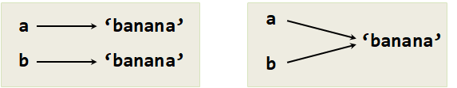

# 리스트 (List) {#r-list}

## 리스트는 순서(sequence)다. {#r-list-sequence}

문자열처럼, 리스트(list)는 값의 순서(sequence)다. 
문자열에서, 값은 문자지만, 리스트에서는 임의 자료형(type)도 될 수 있다.
리스트 값은 요소(elements)나 때때로 항목(items)으로 불린다.

신규 리스틀 생성하는 방법은 여러 가지가 있다. 
가장 간단한 방법은 `list()`함수로 요소를 감싸는 것이다.

```{r r-list-data, eval = FALSE}
list(10, 20, 30, 40)
list('crunchy frog', 'ram bladder', 'lark vomit')
```


첫번째 예제는 4개 정수 리스트다. 
두번째 예제는 3개 문자열 리스트다.
문자열 요소가 동일한 자료형(type)일 필요는 없다. 
다음 리스트는 문자열, 부동 소수점 숫자, 정수, (아!) 또 다른 리스트를 담고 있다.

```{r r-list-list, eval=FALSE}
list('spam', 2.0, 5, list(10, 20))
```


또 다른 리스트 내부에 리스트가 **중첩(nested)**되어 있다.

어떤 요소도 담고 있지 않는 리스트를 빈 리스트(empty list)라고 부르고, `list()`로 생성한다.

예상했듯이, 리스트 값을 변수에 대입할 수 있다.

```{r r-list-print}
(cheeses <- list('Cheddar', 'Edam', 'Gouda'))
(numbers <- list(17, 123))
(empty <- list())
```


## 리스트는 변경가능하다. {#r-list-mutable}

리스트 요소에 접근하는 구문은 문자열 문자에 접근하는 것과 동일한 꺾쇠 괄호 연산자다.
꺽쇠 괄호 내부 표현식은 인덱스를 명세한다. 기억할 것은 인덱스는 1 에서부터 시작한다는 것이다.

```{r r-list-access}
cheeses[1]
```


문자열과 마찬가지로, 리스트 항목 순서를 바꾸거나, 리스트에 새로운 항목을 다시 대입할 수 있기 때문에 리스트는 변경가능하다.
꺾쇠 괄호 연산자가 대입문 왼쪽편에 나타날 때, 새로 대입될 리스트 요소를 나타낸다.

```{r r-list-mutable}
numbers <- list(17, 123)

(numbers[1] <- 5)
```

리스트 numbers 첫번째 요소는 `123` 값을 가지고 있었으나, 이제 `5` 값을 가진다.

리스트를 인덱스와 요소의 관계로 생각할 수 있다. 
이 관계를 **매핑(mapping)**이라고 부른다. 
각각의 인덱스는 요소 중 하나에 **대응("maps to")**된다.

리스트 인덱스는 문자열 인덱스와 동일한 방식으로 동작한다.

- 어떠한 정수 표현식도 인덱스로 사용할 수 있다.
- 존재하지 않는 요소를 읽거나 쓰려고 하면, 일종의 인덱스 오류 (IndexError)로 `NULL`이 반환된다.
- 인덱스가 음의 값이면, 해당 리스트 원소가 누락된다.

`%in%` 연산자도 또한 리스트에서 동작하니 리스트 원소로 존재하는지 여부를 판별하는데 사용할 수 있다.

```{r}
cheeses <- list('Cheddar', 'Edam', 'Gouda')

'Edam' %in% cheeses

'Brie' %in% cheeses
```


## 리스트 운행법 {#r-list-traversal}

리스트 요소를 운행하는 가장 흔한 방법은 `for`문을 사용하는 것이다.
문자열에서 사용한 것과 구문은 동일하다.

```{r r-list-for}
for(cheese in cheeses) {
  print(cheese)
}
```


리스트 요소를 읽기만 한다면 이것만으로도 잘 동작한다. 
하지만, 리스트 요소를 쓰거나, 갱신하는 경우, 인텍스가 필요하다. 
리스트 요소를 쓰거나 갱신하는 일반적인 방법은 `seq_along()` 함수를 조합하는 것이다.


```{r r-list-seq_along}
numbers <- list(1, 2, 3, 4, 5)

for(i in seq_along(numbers)){
  cat("before:", numbers[[i]], "\n")
  numbers[[i]] <- numbers[[i]] * 2
  cat("after:", numbers[[i]], "\n")
}
```


상기 루프는 리스트를 운행하고 각 요소를 갱신한다. 
`seq_along()` 함수는 1 에서 $n$ 까지 리스트 인텍스를 반환한다. 
여기서, $n$은 리스트 길이가 된다.
매번 루프가 반복될 때마다, `i`는 다음 요소 인덱스를 얻는다. 
몸통 부문 대입문은 `i`를 사용해서 요소의 이전 값을 읽고 새 값을 대입한다.

빈 리스트(`list()`)에 대해서 `for`문은 결코 몸통 부문을 실행하지 않는다.

```{r r-list-empty}
for(x in list()) {
  print('This never happens.')
}
```


리스트가 또 다른 리스트를 담을 수 있지만, 중첩된 리스트는 여전히 요소 하나로 간주된다. 
다음 리스트 길이는 4 이다.

```{r r-list-length}
list('spam', 1, list('Brie', 'Roquefort', 'Pol le Veq'), list(1, 2, 3))
```


## 리스트 연산자 {r-list-operator}

`append()` 함수 연산자는 리스트를 추가하여 결합시킨다.

```{r}
a <- list(1, 2, 3)
b <- list(4, 5, 6)
c <- append(a, b)
```

유사하게 `rep()` 함수를 활용하면 주어진 횟수만큼 리스트를 반복한다.

```{r r-list-repeat}
rep(list(0), 4)

rep(list(1, 2, 3), 3)
```


첫 예제는 `list(0)`을 4회 반복한다. 
두 번째 예제는 `list(1, 2, 3)` 리스트를 3회 반복한다.


## 리스트 슬라이스(List slices) {#r-list-slice}

슬라이스 연산자는 리스트에도 또한 동작한다.

```{r r-list-slice}
t <- list('a', 'b', 'c', 'd', 'e', 'f')

t[2:3]

t[1:4]

t[4:length(t)]

t[]
```

첫 번째 인덱스를 1로 지정하면, 슬라이스는 처음부터 시작한다. 
두 번째 인덱스를 `length()` 함수로 리스트 길이를 지정하면, 슬라이스는 끝까지 간다.
그래서 양쪽의 인덱스를 생략하면, `t[]`같이 지정하면 슬라이스 결과는 전체 리스트를 복사한 것이 된다.


리스트는 변경이 가능하기 때문에 리스트를 접고, 돌리고, 훼손하는 연산을 수행하기 전에 복사본을 만들어 두는 것이 유용하다.

대입문 왼편의 슬라이스 연산자로 복수의 요소를 갱신할 수 있다.


```{r r-list-update}
t <- list('a', 'b', 'c', 'd', 'e', 'f')
t[2:3] = list('x', 'y')

t
```


## 리스트 함수 {#r-list-function}

R은 리스트 자료형에 연산할수 있는 함수를 제공한다. 
예를 들어, 덧붙이기 (`append`) 함수는 리스트 끝에 신규 요소를 추가한다.

```{r r-list-function-append}
t <- list('a', 'b', 'c')
append(t, 'd')
```

정렬 (order) 함수는 낮음에서 높음으로 리스트 요소를 정렬한다.
리스트에서 `sapply()` 혹은 `unlist()` 함수로 값으로 변환시키고 `order()` 함수를 통해 내림차순 혹은 오름차순으로 정렬 인덱스를 뽑아 리스트내 원소를 정렬시킨다.

```{r r-list-sort}
t <- list('d', 'c', 'e', 'b', 'a')

t[order(sapply(t,'[[',1))]

t[order(unlist(t), decreasing=TRUE)]
```

## 리스트 요소 삭제 {#r-list-delete}

리스트 요소를 삭제하는 방법이 몇 가지 있다. 
리스트 요소 명칭을 알고 있다면, 리스트 요소에 `NULL`을 대입하여 삭제시킨다.

```{r r-list-delete-by-name}
t <- list(a='a', b='b', c = 'c')
t[["c"]] <- NULL
t$c <- NULL
t
```

`NULL`을 대입하여 삭제시킨 리스트는 제거된 요소를 반환한다.

```{r r-list-delete-by-index}
t[[1]] <- NULL
t
```

`t[[1]]` 리스트 인덱스를 통해 요소에 접근하고 `NULL`을 대입하여 삭제한다.

(인덱스 혹인 리스트 요인 이름이 아닌) 제거할 요소값을 알고 있다면, 
리스트 요인값을 활용해서 제거하는 것도 가능하다.

```{r }
t <- list(a='x', b='y', c = 'z')

t[t != "y"]
```


하나 이상의 요소를 제거하기 위해서, 슬라이스 인덱스(slice index)를 사용하는 것도 가능하다.

```{r r-list-delete-slice}
t <- list('a', 'b', 'c', 'd', 'e', 'f')
t[-c(2:5)]
```

슬라이스는 첫번째 인덱스를 포함하고 두 번째 인덱스까지 모든 요소를 선택한다.


## 리스트와 함수 {#r-list-function}

루프를 작성하지 않고도 리스트를 빠르게 살펴볼 수 있는 리스트에 적용할 수 있는 내장함수를 활용하는 것도 방법이지만,
깔끔한 세상(tidyverse) 생태계의 일원인 `purrr` 함수형 프로그래밍 팩키지에 내장된 함수를 활용하는 것도 권장된다.

하지만, 다음과 같이 1차원 리스트는 `unlist()` 함수를 활용하여 벡터로 변환해서 사용하는 것이 편리한 경우가 많다.

```{r r-list-unlist}
nums <- list(3, 41, 12, 9, 74, 15) %>% unlist

length(nums)
max(nums)
min(nums)
sum(nums)
sum(nums) / length(nums)
```


`sum()`, `max()`, `length()` 등 함수는 입력 자료형이 무엇이냐에 따라 다르게 동작할 수 있고, 입력 자료형에 결측값 등 특이값이 들어있는 경우 기대했던 결과가 나올 수 없으니 필히 자료형을 사전에 점검하고 활용하도록 한다.

리스트를 사용해서, 앞서 작성한 프로그램을 다시 작성해서 사용자가 입력한 숫자 목록 평균을 계산한다. 

우선 리스트 없이 평균을 계산하는 프로그램:

```{r r-list-user-input-average, eval=FALSE}
## 프로그램 명칭: `list_average.R`
total <- 0
count <- 0

while (TRUE) {
  inp <- readline('Enter a number: ')
  if(inp == 'done') break

  value <- as.numeric(inp)
  total <- total + value
  count <- count + 1
}

average <- total / count
cat('Average:', average)
```

상기 프로그램에서, `count` 와 `sum` 변수를 사용해서 반복적으로 사용자가 숫자를 입력하면 값을 저장하고, 
지금까지 사용자가 입력한 누적 합계를 계산한다. R 콘솔에서 `source()` 함수를 사용해서 실행한 결과는 다음과 같다.

``` {r r-list-average-run, eval = FALSE}
> source("code/list_average.R")
Enter a number: 10
Enter a number: 20
Enter a number: 30
Enter a number: done
Average: 20
```


단순하게, 사용자가 입력한 각 숫자를 기억하고 내장함수를 사용해서 프로그램 마지막에 합계와 갯수를 계산한다.

```{r r-list-numlist, eval=FALSE}
## 프로그램 명칭: `list_datatype.R`
numlist <- list()

while (TRUE) {
  inp <- readline('Enter a number: ')
  if(inp == 'done') break

  value <- as.numeric(inp)
  numlist <- append(numlist, value)
}

num_vector <- unlist(numlist)

average <- sum(num_vector) / length(num_vector)
cat('List Average:', average)

```


루프가 시작되기 전 빈 리스트를 생성하고, 매번 숫자를 입력할 때마다 숫자를 리스트에 추가한다.
프로그램 마지막에 간단하게 리스트 총합을 계산하고, 평균을 산출하기 위해서 입력한 숫자 개수로 나눈다. 
R 콘솔에서 `source()` 함수를 사용해서 실행한 결과는 다음과 같다.

``` {r r-list-numlist-run, eval = FALSE}
> source("code/list_datatype-average.R")
Enter a number: 40
Enter a number: 50
Enter a number: 60
Enter a number: done
List Average: 50
```


## 리스트와 문자열 {#r-list-string}

문자열(string)은 **문자 순서(sequence)**이고, 리스트는 **값 순서(sequence)**이다. 
하지만 리스트 문자는 문자열과 같지는 않다. 
문자열을 리스트 문자로 변환하기 위해서, `strsplit()` 함수를 사용한다.

```{r r-list-strsplit}
s <- 'spam'
t <- strsplit(s, NULL)[[1]] %>% strsplit(NULL)
t
```


`list`는 내장함수 이름이기 때문에, 변수명으로 사용하는 것을 피해야 한다.
`l`을 사용하면 1 처럼 보이기 때문에 가능하면 피한다. 그래서, `t`를 사용했다.

`strsplit()` 함수는 문자열을 구분자(이번 경우에는 `NULL`)를 사용해서 문자 각각으로 쪼갠다. 
문자열 단어로 쪼개려면, 구분자를 바꿔 예를 들어 공백을 기준으로 쪼갠다.

```{r r-list-split-separator}
s <- list('pining for the fjords')
t <- strsplit(s[[1]], " ")[[1]] %>% strsplit(" ")
t
```


분할 함수를 사용해서 문자열을 리스트 토큰으로 쪼개면, 인덱스 연산자('[]')를 사용하여 리스트의 특정 단어를 볼 수 있다.

옵션 인자로 단어 경계로 어떤 문자를 사용할 것인지 지정하는데 사용되는 구분자 (delimiter)를 활용하여 분할 `strsplit()` 함수를 호출한다.
다음 예제는 구분자로 하이픈('-')을 사용한 사례다.

```{r r-list-delimiter}
s <- list('spam-spam-spam')
delimiter <- '-'
strsplit(s[[1]], delimiter)[[1]] %>% strsplit(" ")
```

합병 (`paste`) 함수는 분할 (`strsplit`) 함수의 역이다. 
문자열 리스트를 받아 리스트 요소를 연결한다.


```{r r-list-paste}
t <- list('pining', 'for', 'the', 'fjords')
delimiter <- ' '
paste0(t, delimiter, collapse = "")
```


상기의 경우, 구분자가 공백 문자여서 결합 (paste) 함수가 단어 사이에 공백을 넣는다.
공백없이 문자열을 결합하기 위해서, 구분자로 빈 문자열 ''을 사용한다.

## 라인 파싱하기(Parsing) {#r-list-parsing}

파일을 읽을 때 통상, 단지 전체 라인을 출력하는 것 말고 뭔가 다른 것을 하고자 한다.
종종 "흥미로운 라인을" 찾아서 라인을 파싱(parse)하여 흥미로운  부분을 찾고자 한다.
"From "으로 시작하는 라인에서 요일을 찾고자 하면 어떨까?

`From stephen.marquard@uct.ac.za` **Sat** `Jan  5 09:14:16 2008`


이런 종류의 문제에 직면했을 때, `stringr` 팩키지 분할 `str_split()` 함수가 매우 효과적이다.
작은 프로그램을 작성하여 "From "으로 시작하는 라인을 찾고 `str_split()` 함수로 파싱하고 라인의 흥미로운 부분을 출력한다. 

```{r r-list-email-parsing, eval=FALSE}
fhand <- file('data/mbox-short.txt', "r")
for(line in readLines(fhand)) {
  line <- stringr::str_trim(line)
  if(!stringr::str_detect(line, "^From ")) next
  
  words <- stringr::str_split(line, " ")[[1]]
  cat(words[3], "\n")
}
```

`if` 문의 축약 형태를 사용하여 `next` 문을 `if`문과 동일한 라인에 놓았다.
`if` 문 축약 형태는 `next` 문을 들여쓰기를 다음 라인에 한 것과 동일하다.

프로그램은 다음을 출력한다.

```{r r-list-email-parsing-output, eval=FALSE}
Sat
Fri
Fri
Fri
...
```

나중에, 매우 정교한 기술에 대해서 학습해서 정확하게 검색하는 비트(bit) 수준 정보를 찾아 내기 위해서 작업할 라인을 선택하고, 어떻게 해당 라인을 뽑아낼 것이다. 


## 객체와 값(value) {#r-list-object-value}

다음 대입문을 실행하면,

```{r r-list-banana}
a <- 'banana'
b <- 'banana'
```

`a` 와 `b` 모두 문자열을 참조하지만, 두 변수가 동일한 문자열을 참조하는지 알 수 없다.
두 가지 가능한 상태가 있다.



한 가지 경우는 `a` 와 `b`가 같은 값을 가지는 다른 두 객체를 참조하는 것이다. 
두 번째 경우는 같은 객체를 참조하는 것이다.

두 변수가 동일한 객체를 참조하는지를 확인하기 위해서, 파이썬에서는 `is` 연산자가 사용된다.

``` {r a-b-reference, eval=FALSE}
>>> a = 'banana'
>>> b = 'banana'
>>> a is b
True
```

이 경우, 파이썬은 하나의 문자열 객체를 생성하고 `a` 와 `b` 모두 동일한 객체를 참조한다.

하지만, 리스트 두 개를 생성할 때, 객체가 두 개다.

``` {r a-b-list, eval=FALSE}
>>> a = [1, 2, 3]
>>> b = [1, 2, 3]
>>> a is b
False
```


상기의 경우, 두 개의 리스트는 동등하다고 말할 수 있다. 
왜냐하면 동일한 요소를 가지고 있기 때문이다.
하지만, 같은 객체는 아니기 때문에 동일하지는 않다. 
두 개의 객체가 동일하다면, 두 객체는 또한 등등하다.
하지만, 동등하다고 해서 반듯이 동일하지는 않다.

지금까지 "객체(object)"와 "값(value)"을 구분 없이 사용했지만, 객체가 값을 가진다라고 말하는 것이 좀더 정확하다.
`a = [1,2,3]` 을 실행하면, `a` 는 특별한 순서 요소값을 갖는 리스트 객체로 참조한다. 
만약 또 다른 리스트가 동일한 요소를 가진다면, 그 리스트는 같은 값을 가진다고 말한다.

R도 이와 유사하게 참조와 복사에 대해 동일한 개념을 활용하여 처리한다.

## 에일리어싱(Aliasing) {#r-list-aliasing}

`a`가 객체를 참조하고, `b <- a`  대입하다면, 두 변수는 동일한 객체를 참조한다.

```{r r-list-alias}
a <- list(1, 2, 3)
b <- a

a <- list(4,5,6)

identical(a, b)
```


객체와 변수의 연관짖는 것을 **참조(reference)**라고 한다. 
상기의 경우 동일한 객체에 두 개의 참조가 있다.

하나 이상의 참조를 가진 객체는 한개 이상의 이름을 갖게 되어서, 객체가 **에일리어스(aliased)** 되었다고 한다.

만약 에일리어스된 객체가 변경 가능하면, 변화의 여파는 다른 객체에도 파급된다.

이와 같은 행동이 유용하기도 하지만, 오류를 발생시키기도 쉽다. 
일반적으로, **변경가능한 객체(mutable object)**로 작업할 때 에일리어싱을 피하는 것이 안전하다.

파이썬 문자열 같이 변경 불가능한 객체에 에일리어싱은 그렇게 문제가 되지 않는다. 

``` {r a-b-reference-python-banana, eval=FALSE}
>>> a = 'banana'
>>> b = 'banana'
```

상기 예제에서, `a` 와 `b`가 동일한 문자열을 참조하든 참조하지 않든 거의 차이가 없다.


## 디버깅 {#r-list-debug}

부주의한 리스트 사용이나 변경가능한 객체를 사용하는 경우 디버깅을 오래 할 수 있다.
다음에 일반적인 함정 유형과 회피하는 방법을 소개한다.


1. **관용구를 선택하고 고수하라.**

리스트와 관련된 문제 일부는 리스트를 가지고 할 수 있는 것이 너무 많다는 것이다.


2. **에일리어싱을 회피하기 위해서 사본 만들기.**

인자를 변경하는 정렬 (sort)같은 메쏘드를 사용하지만, 원 리스트도 보관되길 원한다면, 사본을 만든다.

``` {r r-list-debug-aliasing, eval = FALSE}
orig <- t
t[t(unlist(t), decreasing=TRUE)]
```

상기 예제에서 원 리스트는 그대로 둔 상태로 새로 정렬된 리스트를 반환된 결과는 `t`에 저장한다.
하지만 이 경우에는, 변수명으로 `sorted`를 사용하는 것을 피해야 한다!

3. **리스트, 분할 (split), 파일**

파일을 읽고 파싱할 때, 프로그램이 중단될 수 있는 입력값을 마주할 수많은 기회가 있다.
그래서 파일을 훑어 "건초더미에서 바늘"을 찾는 프로그램을 작성할 때 사용한 가디언 패턴(guardian pattern)을 다시 살펴보는 것은 좋은 생각이다.

파일 라인에서 요일을 찾는 프로그램을 다시 살펴보자.


`From stephen.marquard@uct.ac.za` **Sat** `Jan  5 09:14:16 2008`

각 라인을 단어로 나누었기 때문에, startswith를 사용하지 않고, 라인에 관심있는 단어가 있는지 살펴보기 위해서 단순하게 각 라인의 첫 단어를 살펴본다.
다음과 같이 continue 문을 사용해서 "From"이 없는 라인을 건너 뛴다. 

```{r r-list-email-parsing-ex, eval=FALSE}
fhand <- file('data/mbox-short.txt', "r")
for(line in readLines(fhand)) {
  if(!stringr::str_detect(line, "^From ")) next
  
  words <- stringr::str_split(line, " ")[[1]]
  cat(words[3], "\n")
}
```

프로그램이 훨씬 간단하고, 파일 끝에 있는 새줄(newline)을 제거하기 위해 `str_trim()` 함수를 사용할 필요도 없다.
하지만, 더 좋아졌는가?


작동하는 것 같지만, 경우에 따라서 첫줄에 Sat 를 출력하고 나서 오류로 프로그램이 정상 동작에 실패하는 경우도 있다.
무엇이 잘못되었을까?  어딘가 엉망이 된 데이터가 있어 우아하고, 총명하며, 매우 R스러운 프로그램을 망가뜨린건가?

오랜 동안 프로그램을 응시하고 머리를 짜내거나, 다른 사람에게 도움을 요청할 수 있지만, 빠르고 현명한 접근법은 `print()`문을 추가하는 것이다.
`print()`문을 넣는 가장 좋은 장소는 프로그램이 동작하지 않는 라인 앞이 적절하고, 프로그램 실패를 야기할 것 같은 데이터를 출력한다.

이 접근법이 많은 라인을 출력하지만, 즉석에서 문제에 대해서 손에 잡히는 단서는 최소한 준다. 
그래서 words를 출력하는 출력문을 5번째 라인 앞에 추가한다. 
"Debug:"를 접두어로 라인에 추가하여, 정상적인 출력과 디버그 출력을 구분한다.

```{r r-list-email-parsing-ex-print, eval=FALSE}
fhand <- file('data/mbox-short.txt', "r")
for(line in readLines(fhand)) {
  line <- stringr::str_trim(line)
  cat("Debug", line, "\n")
  if(!stringr::str_detect(line, "^From ")) next
  
  words <- stringr::str_split(line, " ")[[1]]
  cat(words[3], "\n")
}
```


프로그램을 실행할 때, 많은 출력결과가 스크롤되어 화면 위로 지나간다. 
마지막에 디버그 결과물과 역추적(traceback)을 보고 역추적(traceback) 바로 앞에서 무슨 일이 생겼는지 알 수 있다.

``` {r r-list-print-debug, eval = FALSE}
Debug: 'X-DSPAM-Confidence:', '0.8475'
Debug: 'X-DSPAM-Probability:', '0.0000'
Debug: 
```


각 디버그 라인은 리스트 단어를 출력하는데, 라인을 분할 `str_split()` 함수를 활용하여 단어로 만들 때 얻어진다.
프로그램이 실패할 때 리스트 단어는 비었다 ''. 
텍스트 편집기로 파일을 열어 살펴보면 그 지점은 다음과 같다.

``` {r r-list-debug-file, eval = FALSE}
X-DSPAM-Result: Innocent
X-DSPAM-Processed: Sat Jan 5 09:14:16 2008
X-DSPAM-Confidence: 0.8475
X-DSPAM-Probability: 0.0000

Details: http://source.sakaiproject.org/viewsvn/?view=rev&rev=39772
```


프로그램이 빈 라인을 만났을 때, 오류가 발생한다. 
물론, 빈 라인은 '0' 단어 ("zero words")다.
프로그램을 작성할 때, 왜 이것을 생각하지 못했을까?
첫 단어(word[1])가 "From"과 일치하는지 코드가 점검할 때, "인덱스 범위 오류(index out of range)"가 발생한다.

물론, 첫 단어가 없다면 첫 단어 점검을 회피하는 **가디언 코드(guardian code)**를 삽입하기 최적 장소이기는 하다.
코드를 보호하는 방법은 많다. 첫 단어를 살펴보기 전에 단어의 갯수를 확인하는 방법을 택한다.

```{r r-list-email-parsing-ex-guardian, eval=FALSE}
fhand <- file('data/mbox-short.txt', "r")
for(line in readLines(fhand)) {
  line <- stringr::str_trim(line)
  # cat("Debug", line, "\n")
  if(length(words) == 0) next
  if(!stringr::str_detect(line, "^From ")) next
  
  words <- stringr::str_split(line, " ")[[1]]
  cat(words[3], "\n")
}
```


변경한 코드가 실패해서 다시 디버그할 경우를 대비해서, `print`문을 제거하는 대신에 `print`문을 주석 처리한다.
그리고 나서, 단어가 '0' 인지를 살펴보고 만약 '0' 이면, 파일 다음 라인으로 건너뛰도록 `next`문을 사용하는 가디언 문장(guardian statement)을 추가한다.

두 개 `next`문이 "흥미롭고" 좀더 처리가 필요한 라인 집합을 정제하도록 돕는 것으로 생각할 수 있다.
단어가 없는 라인은 "흥미 없어서" 다음 라인으로 건너뛴다. 첫 단어에 "From"이 없는 라인도 "흥미 없어서" 건너뛴다.

변경된 프로그램이 성공적으로 실행되어서, 아마도 올바르게 작성된 것으로 보인다. 
가디언 문장(guardian statement)이 `words[1]`가 정상작동할 것이라는 것을 확인해 주지만, 충분하지 않을 수도 있다.
프로그램을 작성할 때, "무엇이 잘못 될 수 있을까?"를 항상 생각해야만 한다.


**연습문제:** 상기 프로그램의 어느 라인이 여전히 적절하게 보호되지 않은지를 생각해 보세요.
텍스트 파일을 구성해서 프로그램이 실패하도록 만들 수 있는지 살펴보세요.
그리고 나서, 프로그램을 변경해서 라인이 적절하게 보호되게 하고, 
새로운 텍스트 파일을 잘 다룰 수 있도록 시험하세요.


**연습문제:** 두 `if` 문 없이, 상기 예제의 가디언 코드(guardian code)를 다시 작성하세요.
대신에 단일 `if`문과 `&` 논리 연산자를 사용하는 복합 논리 표현식을 사용하세요.

## 용어정의 {#r-list-terminology}

- **에일리어싱(aliasing)**: 하나 혹은 그 이상의 변수가 동일한 객체를 참조하는 상황.
- **구분자(delimiter)**: 문자열이 어디서 분할되어져야 할지를 표기하기 위해서 사용되는 문자나 문자열.
- **요소(element)**: 리스트 혹은 다른 순서(sequence) 값의 하나로 항목(item)이라고도 한다.
- **동등한(equivalent)**: 같은 값을 가짐.
- **인덱스(index)**: 리스트의 요소를 지칭하는 정수 값.
- **동일한(identical)**: 동등을 함축하는 같은 객체임.
- **리스트(list)**: 순서(sequence) 값.
- **리스트 운행법(list traversal)**: 리스트의 각 요소를 순차적으로 접근함.
- **중첩 리스트(nested list)**: 또 다른 리스트의 요소인 리스트.
- **객체(object)**: 변수가 참조할 수 있는 무엇. 객체는 자료형(type)과 값(value)을 가진다.
- **참조(reference)**: 변수와 값의 연관.

## 연습문제 {#r-list-ex}


1. [http://www.py4inf.com/code/romeo.txt](http://www.py4inf.com/code/romeo.txt)에서 파일 사본을 다운로드 받으세요.
`romeo.txt` 파일을 열어, 한 줄씩 읽어들이는 프로그램을 작성하세요.
각 라인마다 stringr 팩키지에서 분할 `str_split()` 함수를 사용하여 라인을 단어 리스트로 쪼개세요.

각 단어마다, 단어가 이미 리스트에 존재하는지를 확인하세요. 
만약 단어가 리스트에 없다면, 리스트에 새 단어로 추가하세요.

프로그램이 완료되면, 알파벳 순으로 결과 단어를 정렬하고 출력하세요.

``` {r r-list-romeo, eval=FALSE}
Enter file: romeo.txt
[1] 'Arise', 'But', 'It', 'Juliet', 'Who', 'already',
'and', 'breaks', 'east', 'envious', 'fair', 'grief',
'is', 'kill', 'light', 'moon', 'pale', 'sick', 'soft',
'sun', 'the', 'through', 'what', 'window',
'with', 'yonder'
```


2. 전자우편 데이터를 읽어 들이는 프로그램을 작성하세요.
"From"으로 시작하는 라인을 발견했을 때, stringr 팩키지에서 분할 `str_split()` 함수를 사용하여 라인을 단어로 쪼개세요.
"From" 라인의 두번째 단어, 누가 메시지를 보냈는지에 관심이 있다.

`From stephen.marquard@uct.ac.za Sat Jan  5 09:14:16 2008` 

"From" 라인을 파싱하여 각 "From"라인의 두번째 단어를 출력한다.
그리고 나서, "From:"이 아닌 "From"라인 갯수를 세고, 끝에 갯수를 출력한다.

여기 몇 줄을 삭제한 출력 예시가 있다.

``` {r r-list-fromcount, eval=FALSE}
Rscript fromcount.R
Enter a file name: mbox-short.txt

stephen.marquard@uct.ac.za
louis@media.berkeley.edu
zqian@umich.edu

[...some output removed...]

ray@media.berkeley.edu
cwen@iupui.edu
cwen@iupui.edu
cwen@iupui.edu

There were 27 lines in the file with From as the first word
```


3. 사용자가 숫자 리스트를 입력하고, 입력한 숫자 중에 최대값과 최소값을 출력하고 사용자가 "done"을 입력할 때 종료하는 프로그램을 다시 작성하세요.
사용자가 입력한 숫자를 리스트에 저장하고, `max()` 과 `min()` 함수를 사용하여 루프가 끝나면, 최대값과 최소값을 출력하는 프로그램을 작성하세요.

``` {r r-list-ex03, eval=FALSE}
Enter a number: 6
Enter a number: 2
Enter a number: 9
Enter a number: 3
Enter a number: 5
Enter a number: done
Maximum: 9.0
Minimum: 2.0
```

